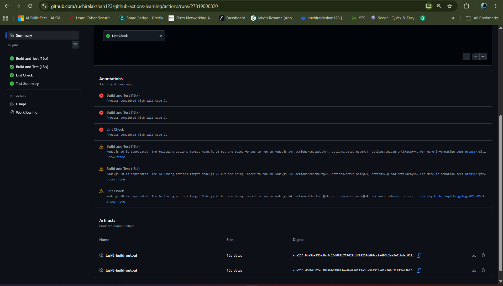
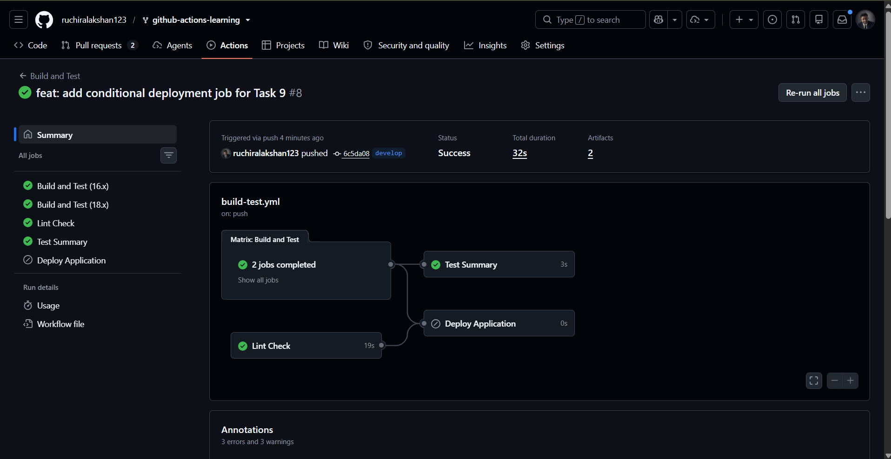

# Advanced Badge Submission - Ruchira

**Date:** January 2026  
**Status:** Submitted for Review  
**Branch:** `submission/advanced-badge-ruchira-lakshan`

---

## 📋 Completed Tasks

- [x] **Task 8: Upload and Download Artifacts** (Generated and uploaded build artifact outputs using `actions/upload-artifact@v4`)
- [x] **Task 9: Conditional Execution** (Configured environment-based deployment restrictions ensuring execution only on the `main` branch)
- [x] **Task 10: Create a PR and Use Issue Templates** (Opened a structured Pull Request and registered tracking issue using standard templates)

---

## 📷 Evidence

### Task 8: Upload and Download Artifacts
*The screenshot below displays the successfully produced build artifact (`task8-build-output`) listed inside the Artifacts section on the workflow summary page:*

---

### Task 9: Conditional Execution
*The screenshot below demonstrates that the deployment job (`Deploy Application`) was successfully skipped because the workflow was run on the `develop` branch rather than the `main` branch:*

---

### Task 10: Pull Request Verification
*The Pull Request opened from the advanced submission branch to the main repository:*

*(You can paste your PR screenshot here after creating the Pull Request on GitHub)*

---

## 💡 Notes & Reflection
- Confirmed that build assets can be packaged and stored reliably as artifacts across multi-stage workflows.
- Successfully implemented precise runtime logical parameters (`if: github.ref == 'refs/heads/main'`) to prevent unauthorized/premature deployments to production servers.