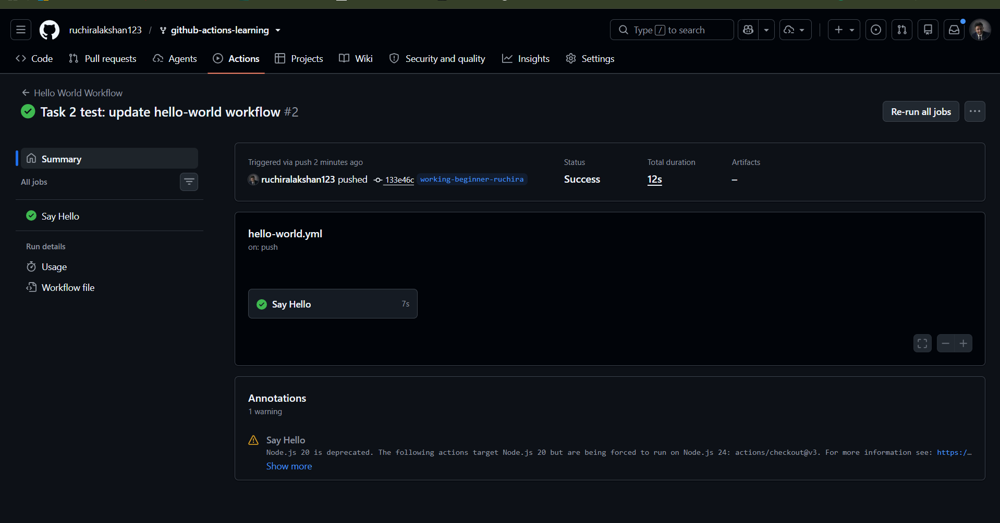
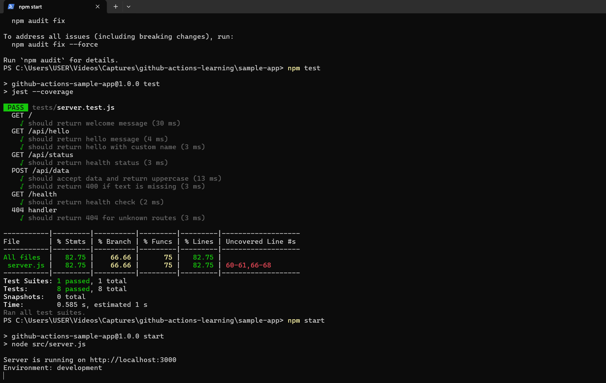
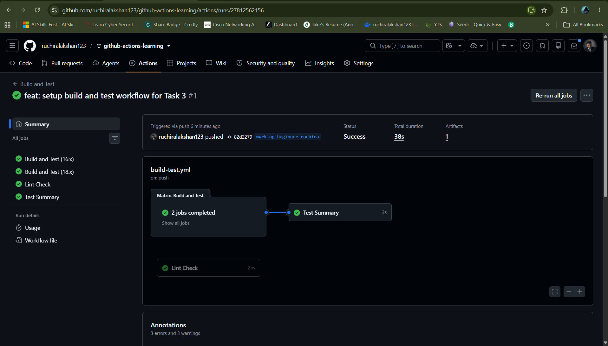

# Beginner Badge Submission - Ruchira

**Date:** January 2026  
**Status:** Submitted for Review  
**Branch:** `working-beginner-ruchira`

---

## 📋 Completed Tasks

- [x] **Task 1: Run Your First Workflow** (Manually triggered "Hello World" workflow via `workflow_dispatch` on main branch)
- [x] **Task 2: Understand Workflow Triggers** (Automatically triggered workflow on `push` event to the working branch)
- [x] **Task 3: Build and Test Locally & CI Setup** (Executed application, ran tests locally, and verified automated CI execution)

---

## 📷 Evidence

### Task 1: Hello World Workflow (Manual Trigger)
*The screenshot below displays the successful manual execution of the Hello World workflow via the `workflow_dispatch` event on the main branch:*

---

### Task 2: Push Event Trigger
*The screenshot below demonstrates the Hello World workflow triggering automatically upon pushing code to the `working-beginner-ruchira` branch:*

---

### Task 3: Local Build & Test Verification

#### 1. Local Test Execution (`npm test`) & Server Run (`npm start`)
*The console output below verifies that all 8 unit tests passed successfully on the local system, and the application server launched on port 3000:*

#### 2. Localhost Verification
*The web browser displaying the active React/Node application homepage at `localhost:3000`:*

#### 3. GitHub Actions CI/CD Pipeline
*The successful status of the automated build and test pipeline running on Node.js matrix versions (16.x and 18.x):*

---

## 💡 Notes & Reflection
- Confirmed that workflows behave properly under both manual execution (`workflow_dispatch`) and automated event triggers (`push`).
- Verified that the build process and test suites run smoothly in a multi-environment matrix.