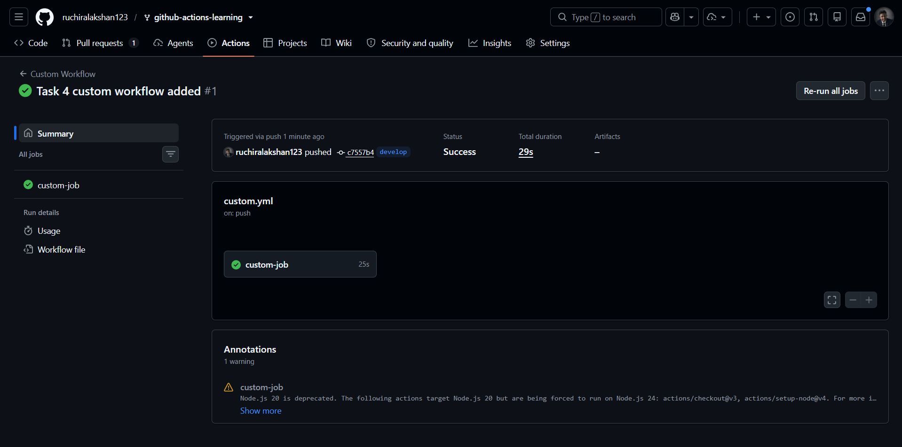
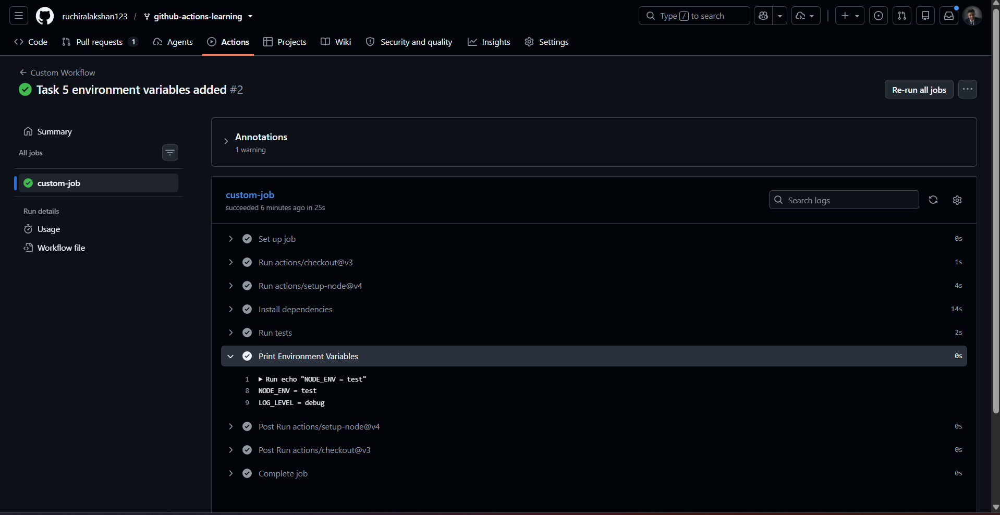
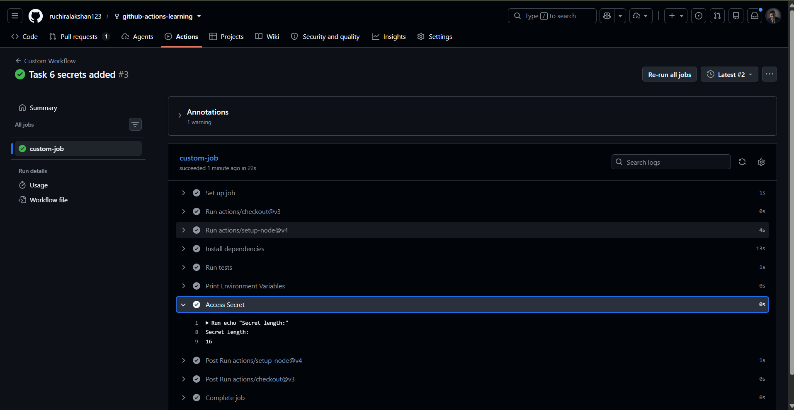
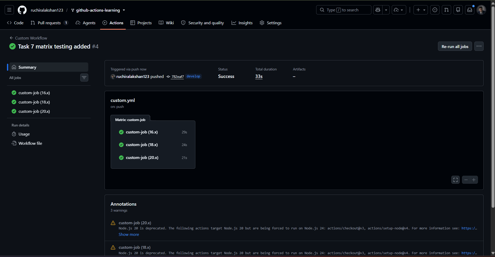

# Intermediate Badge Submission - Ruchira

**Date:** January 2026  
**Status:** Submitted for Review  
**Branch:** `submission/intermediate-badge-ruchira-lakshan`

---

## 📋 Completed Tasks

- [x] **Task 4: Create a Custom Workflow** (Created `custom-workflow.yml` executing on custom branch push)
- [x] **Task 5: Add Environment Variables** (Initialized and verified global and local step-level environment variables)
- [x] **Task 6: Use GitHub Secrets** (Created repository secrets and safely accessed them with automatic masking)
- [x] **Task 7: Matrix Testing** (Configured testing parallelization across Node.js versions 16.x, 18.x, and 20.x)

---

## 📷 Evidence

### Task 4: Create a Custom Workflow
*The screenshot below shows the successful execution of the custom workflow (`custom-workflow.yml`) on the custom submission branch:*

---

### Task 5: Add Environment Variables
*The screenshot below displays the printed global and local environment variables within the workflow execution logs:*

---

### Task 6: GitHub Secrets Access
*The execution logs below demonstrate the secure extraction of repository secrets, verified by the secure automatic masking output (`***`):*

---

### Task 7: Matrix Testing Strategy
*Verification of the Build and Test workflow successfully executing parallel test jobs across Node.js versions 16.x, 18.x, and 20.x:*

---

## 💡 Notes & Reflection
- Confirmed that repository secrets remain completely masked during log outputs to prevent credential leakage.
- Successfully utilized the matrix strategy configuration to run identical testing procedures concurrently on multiple environment setups.